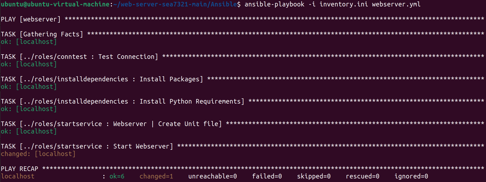
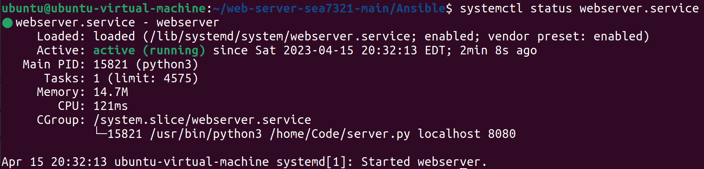
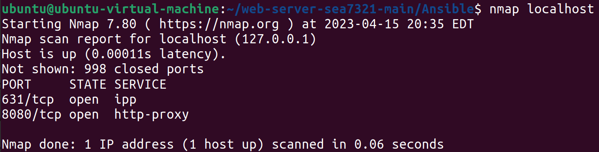

# Web Scraper - Ansible

## Description
An Ansible playbook that deploys the webserver on an Ubuntu system as a service. Please note that a copy of the source
code folder **"Code"** must be in the system's local home directory for easy file path execution. This is shown below
in the "installing" section.

## Getting Started

### Dependencies
* Ansible

### Installing
```
# Clone this repository
$ git clone https://github.com/CSEC731/web-server-sea7321

# Go into the Ansible directory
$ cd web-server/Ansible

# Copy the source code to the home directory
$ sudo cp -r ../Code /home

# Install dependencies
$ pip install ansible
```

### Executing program

```
# Run the Ansible Playbook
$ ansible-playbook -i inventory.ini webserver.yml
```



### Verify System Service

```
# Verify webserver.service is running
$ systemctl status webserver.service
```



---

```
# Verify there is an open port on 8080
$ nmap localhost
```



## Author
Savannah Alfaro, sea2985@rit.edu