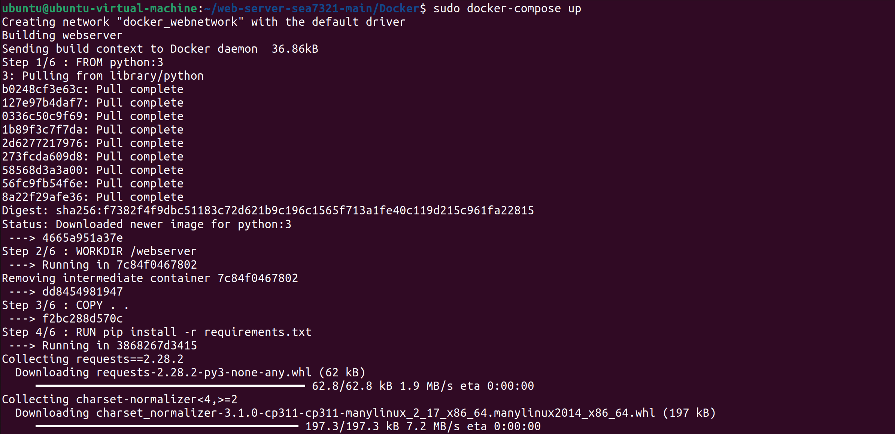
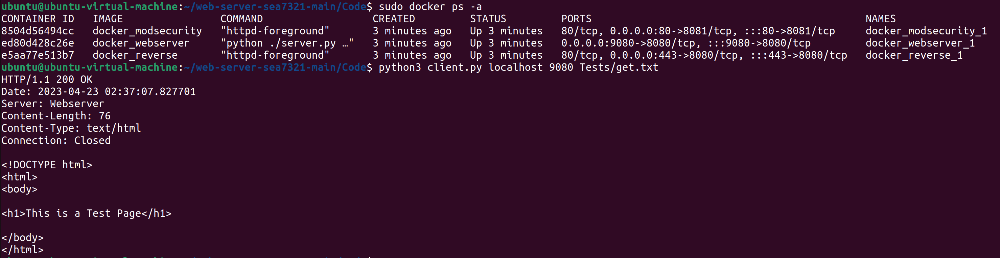

# Web Scraper - Docker


## Description
Docker setup to start the webserver with two proxies.

## Getting Started

### Dependencies
* Docker

### Installing
```
# Clone this repository
$ git clone https://github.com/CSEC731/web-server-sea7321

# Go into the repository
$ cd web-server/Docker

# Install Docker
$ sudo apt install docker docker-compose docker.io
```

### Executing program

```
# Start the Docker containers
$ sudo docker-compose up
```

### Verify Docker Containers

```
# Verify the docker containers are running
$ sudo docker ps -a
```



### Docker Structure
```
172.16.1.0/24 Subnet
  - 172.16.1.1 Gateway
  - 172.16.1.2 Webserver
  - 172.16.1.3 HTTPS proxy
  - 172.16.1.4 HTTPS modsecurity proxy
```

## Author
Savannah Alfaro, sea2985@rit.edu