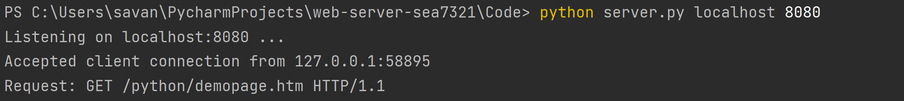
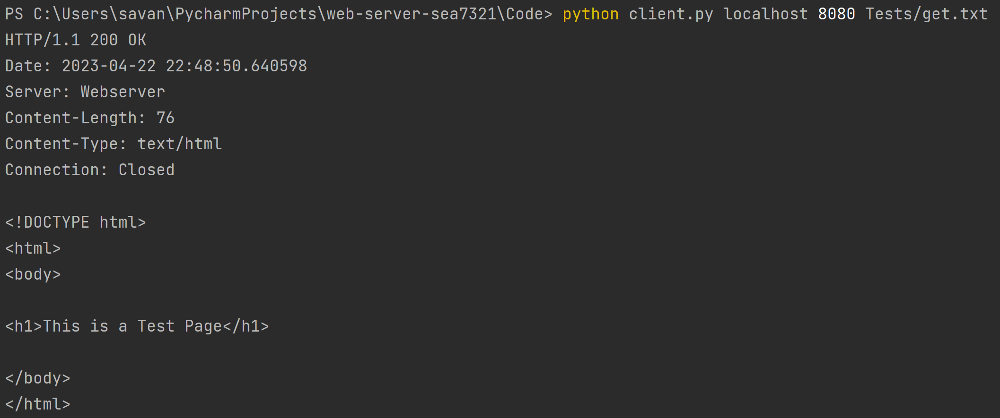
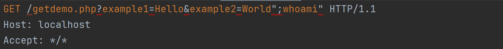
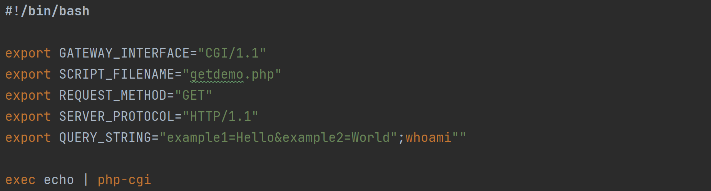
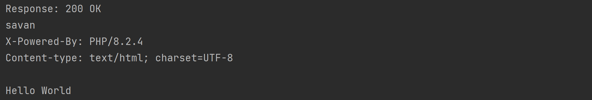

# Web Scraper



## Description
A webserver that reads in a request file, parses the request, and executes the request.

## Getting Started

### Dependencies
* Python3
* Requests

### Installing
```
# Clone this repository
$ git clone https://github.com/CSEC731/web-server-sea7321

# Go into the repository
$ cd web-server

# Install dependencies
$ pip install -r requirements.txt
```

### Executing program

```
# Start the server
$ python3 server.py <ip_address> <port>
$ python3 server.py localhost 8080

# Start the client
$ python3 client.py <ip_address> <port> <input_filename>
$ python3 client.py localhost 8080 get.txt
```

## Command Injection Demonstration

### Description

Command injection (also known as shell injection) is a web application vulnerability that allows an attacker to execute
arbitrary operating system commands on the server that is running the application. This application server's executed
GET requests are vulnerable to command injection. An example of a command injection vulnerability is shown below, but a
full technical report can be found within the application's *Documents* folder.

### Vulnerability Example Execution

```
# Start the server
$ python3 server.py localhost 8080

# Start the client
$ python3 client.py localhost 8080 get_php.txt
```

### Vulnerability Demonstration

The first step is to inject a command into one of the url arguments. In the example below, the command whoami is
injected after the second argument. Note that the full command injected is “;whoami” including the quotes and preceding
semicolon.



---

Next, the server fills in the get request template with the arguments passed from the request input file to create a
shell script. As shown below, you can see the injected whoami command.



---

After creating the shell script, the server will create a subprocess to run the shell script depending on the operating
system being run. The screenshot below shows the intended php script output in addition to the injected whoami command.



## Author
Savannah Alfaro, sea2985@rit.edu